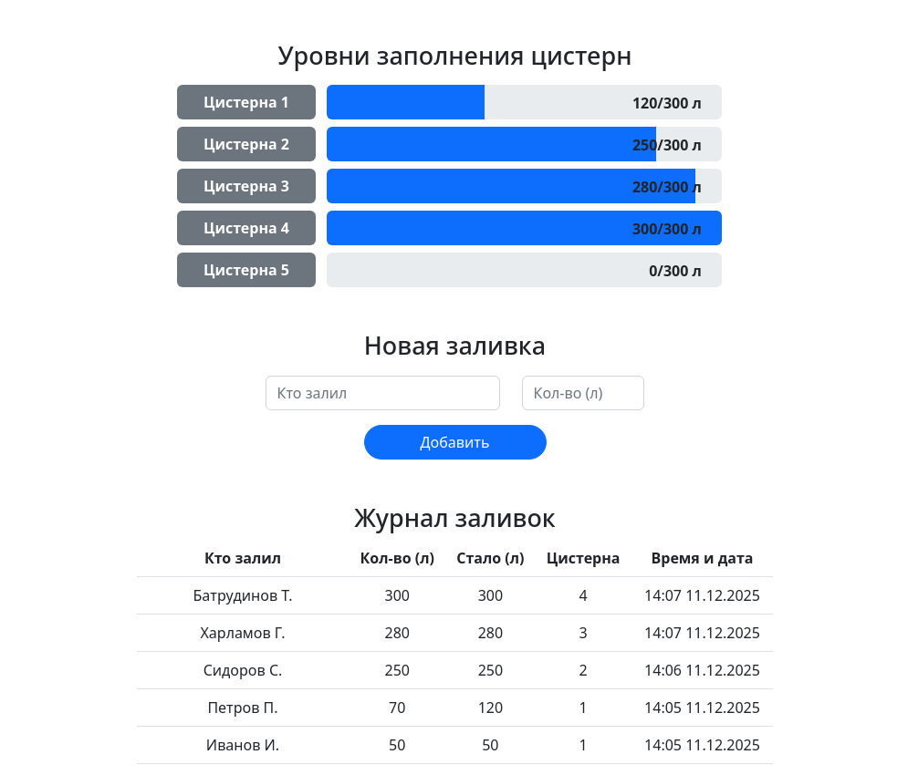

# Система учета и распределения молока (на фреймворке Yii2)

Данное одноэкранное веб-приложение предназначено для ведения учета розлива молока по 5-и цистернам, каждая из которых вмещает до 300 литров.

При каждом вводе данных молоко автоматически заливается в одну подходящую цистерну, равномерно заполняя все цистерны. Форма для ввода данных имеет поля: кто залил, количество (в литрах, целыми числами). Также отображается статистика по цистернам, в виде таблицы с полями: кто залил, количество (л), стало (л), номер цистерны, время и дата заливки.

### Особенности:

1. Работа без перезагрузки страницы.
2. Красивое визуальное оформление на современном фреймворке Bootstrap v5.3.

\
 \
Веб-интерфейс приложения \
&nbsp;

## Системные требования

- Windows/Linux/macOS.
- Docker.

## Установка и запуск

1. Создайте файл `.env` с переменными среды, методом копирования шаблонного файла `.env.template`.

``` bash
cp ./.env.template ./.env
```

2. Измените значения переменных файла `.env`.

``` bash
APP_PORT=8080

DB_DATABASE=milk_accounting_system
DB_USER=root
DB_PASSWORD=your_root_password
```

3. Создайте и запустите контейнеры с компонентами приложения.

``` bash
docker compose up -d
```

4. Запустите миграции для задания табличных структур в базе данных.

``` bash
docker compose exec -i app php yii migrate --interactive=0
```

5. Откройте приложение в веб-браузере, перейдя по адресу (откроется в веб-браузере):

[http://localhost:8080/](http://localhost:8080/)
